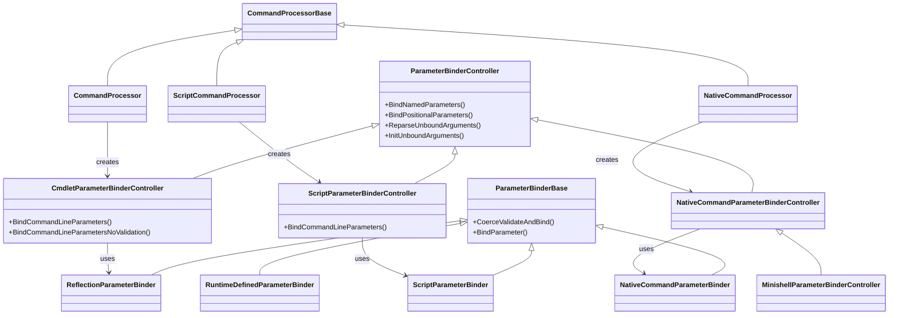
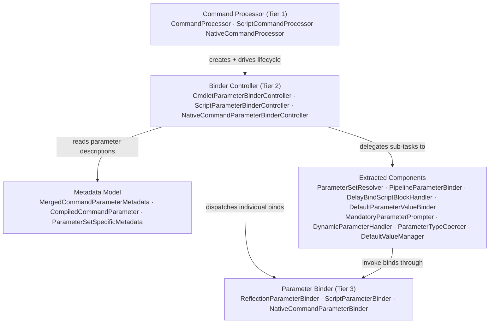
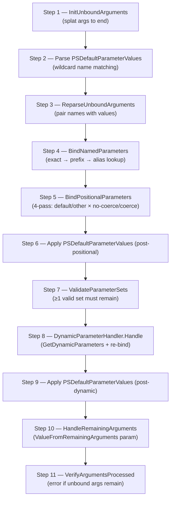
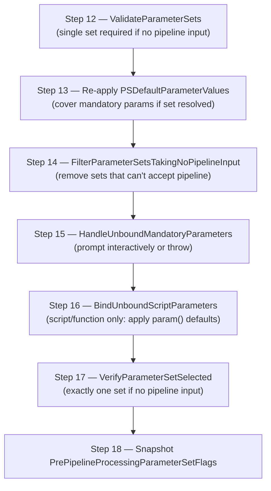
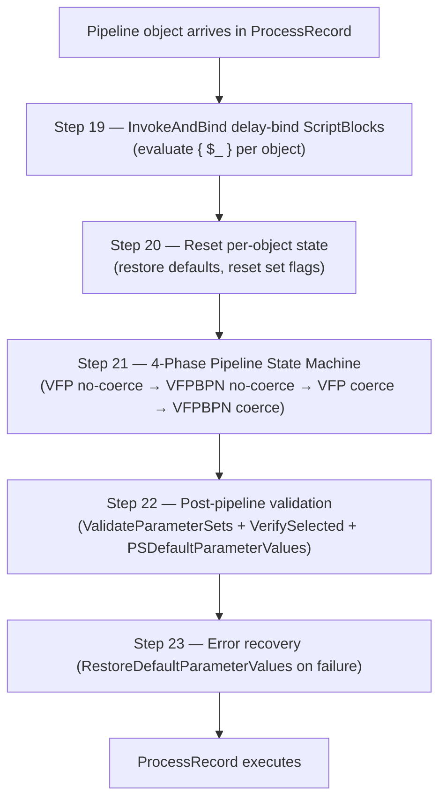
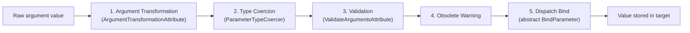

# PowerShell Parameter Binding System

## Overview

Parameter binding is the process by which PowerShell resolves command arguments — typed at the prompt, splatted from a hashtable, or arriving via the pipeline — and delivers them as typed, validated values to the correct properties or variables inside a command implementation.

Every command invocation in PowerShell goes through the parameter binding subsystem. When you write:

```powershell
Get-ChildItem -Path C:\Temp -Recurse
```

the engine must:

1. Tokenise `-Path` and `C:\Temp` into an argument pair.
2. Look up which parameter on `Get-ChildItem` is named `Path`.
3. Coerce `"C:\Temp"` to a `System.String` (already a string here, but the coercion step always runs).
4. Run any validation attributes on the parameter.
5. Set the `Path` property on the `GetChildItemCommand` instance via reflection.

The same machinery handles positional arguments, pipeline objects arriving one-by-one in `ProcessRecord`, `$PSDefaultParameterValues`, splatted hashtables, delay-bind ScriptBlocks, dynamic parameters, and mandatory-parameter prompting.

### Layered Architecture

The binding system is organised in three tiers:

| Tier | Name | Responsibility |
|------|------|---------------|
| 1 | **Command Processors** | Drive the cmdlet/script/native lifecycle (`Prepare → BeginProcessing → ProcessRecord → EndProcessing`) and initiate binding at each lifecycle phase. |
| 2 | **Binder Controllers** | Orchestrate the full binding algorithm: initialise arguments, reparse, bind named parameters, bind positional parameters, invoke dynamic-parameter discovery, validate parameter sets, handle defaults and mandatory prompting, and drive pipeline binding. |
| 3 | **Parameter Binders** | Physically write a single typed value to its destination: a CLR property (reflection), a `SessionStateScope` variable, or an argument string for a native executable. |

Alongside the three tiers there are **extracted single-responsibility components** (e.g. `ParameterSetResolver`, `PipelineParameterBinder`) and a rich **metadata model** that describes every parameter at compile time.

---

## Architecture Diagrams

### Class Hierarchy



### Component Relationships



---

## Actors and Their Roles

### Tier 1: Command Processors

Command processors own the cmdlet/script/native lifecycle. They are responsible for creating the binder controller and calling into it at the right lifecycle moments.

#### `CommandProcessor`

- **File**: [`src/System.Management.Automation/engine/CommandProcessor.cs`](../../src/System.Management.Automation/engine/CommandProcessor.cs)
- **Role**: Drives cmdlet binding. In `Prepare()` it calls `BindCommandLineParameters()` on the `CmdletParameterBinderController`. In `ProcessRecord()` it calls `PipelineParameterBinder.BindPipelineParameters()` for each incoming pipeline object.
- **Key methods**: `Prepare()`, `ProcessRecord()`

#### `ScriptCommandProcessor`

- **File**: [`src/System.Management.Automation/engine/ScriptCommandProcessor.cs`](../../src/System.Management.Automation/engine/ScriptCommandProcessor.cs)
- **Role**: Drives script/function binding. Creates a `ScriptParameterBinderController` and calls `BindCommandLineParameters()`. Does not participate in per-object pipeline binding (the script block receives `$input` directly).
- **Key methods**: `Prepare()`

#### `NativeCommandProcessor`

- **File**: [`src/System.Management.Automation/engine/NativeCommandProcessor.cs`](../../src/System.Management.Automation/engine/NativeCommandProcessor.cs)
- **Role**: Drives external-executable binding. Creates a `NativeCommandParameterBinderController` which assembles an argument string; actually spawns the process on `ProcessRecord`.
- **Key methods**: `Prepare()`, `ProcessRecord()`

---

### Tier 2: Binder Controllers

Binder controllers orchestrate the entire binding algorithm. They keep the list of unbound arguments, track the current valid parameter set, and coordinate all the extracted components. They do **not** directly write values to properties; they delegate every individual write down to Tier 3.

#### `ParameterBinderController` (abstract base)

- **File**: [`src/System.Management.Automation/engine/ParameterBinderController.cs`](../../src/System.Management.Automation/engine/ParameterBinderController.cs)
- **Role**: Defines shared argument-parsing and parameter-matching logic.
- **Key methods**: `InitUnboundArguments()`, `ReparseUnboundArguments()`, `BindNamedParameters()`, `BindPositionalParameters()`

#### `CmdletParameterBinderController`

- **File**: [`src/System.Management.Automation/engine/CmdletParameterBinderController.cs`](../../src/System.Management.Automation/engine/CmdletParameterBinderController.cs)
- **Role**: Full cmdlet algorithm: 23-step process covering command-line binding, parameter set validation, mandatory prompting, and pipeline binding. Maintains six sub-binder associations (declared formal, common, ShouldProcess, paging, transaction, dynamic).
- **Key methods**: `BindCommandLineParameters()`, `BindCommandLineParametersNoValidation()`, `HandleRemainingArguments()`, `VerifyArgumentsProcessed()`

#### `ScriptParameterBinderController`

- **File**: [`src/System.Management.Automation/engine/scriptparameterbindercontroller.cs`](../../src/System.Management.Automation/engine/scriptparameterbindercontroller.cs)
- **Role**: Command-line binding path for all script-based commands (simple functions, filters, and advanced functions with `[CmdletBinding()]`). Binds named, then positional parameters against the full parameter metadata (which includes parameter sets and `DynamicParam`-declared parameters pre-merged at construction time), then sets defaults from the `param()` block, then collects leftovers into `$args`. Does not run the `CmdletParameterBinderController` validation/disambiguation pipeline (no `ParameterSetResolver`, no `MandatoryParameterPrompter`, no `PipelineParameterBinder` per-object rebinding).
- **Key methods**: `BindCommandLineParameters()`, `BindUnboundScriptParameters()`

#### `NativeCommandParameterBinderController`

- **File**: [`src/System.Management.Automation/engine/NativeCommandParameterBinderController.cs`](../../src/System.Management.Automation/engine/NativeCommandParameterBinderController.cs)
- **Role**: Pass-through binding for external executables. No parameter metadata is consulted; all arguments are forwarded as strings with platform-specific quoting.
- **Key methods**: `BindCommandLineParameters()`

#### `MinishellParameterBinderController`

- **File**: [`src/System.Management.Automation/engine/MinishellParameterBinderController.cs`](../../src/System.Management.Automation/engine/MinishellParameterBinderController.cs)
- **Role**: Extends native binding for `pwsh -Command` and `pwsh -File` invocations. Inserts `-InputFormat` and `-OutputFormat` arguments for serialisation format negotiation between PowerShell processes.

---

### Tier 3: Parameter Binders

Parameter binders perform the final write: they receive a typed, validated value from the `CoerceValidateAndBind` inner pipeline and store it in the appropriate target.

#### `ParameterBinderBase` (abstract base)

- **File**: [`src/System.Management.Automation/engine/ParameterBinderBase.cs`](../../src/System.Management.Automation/engine/ParameterBinderBase.cs)
- **Role**: Implements the shared `CoerceValidateAndBind()` method that every parameter bind passes through (transform → coerce → validate → obsolete-warn → dispatch). Declares the abstract `BindParameter()` that concrete binders override.
- **Key methods**: `CoerceValidateAndBind()`, abstract `BindParameter()`

#### `ReflectionParameterBinder`

- **File**: [`src/System.Management.Automation/engine/ReflectionParameterBinder.cs`](../../src/System.Management.Automation/engine/ReflectionParameterBinder.cs)
- **Role**: Writes values to cmdlet CLR properties via compiled expression delegates (avoids reflection overhead per-call after warm-up). Used for all `[Cmdlet]`-derived classes.
- **Key methods**: `BindParameter()`, `StoreParameterValue()`

#### `ScriptParameterBinder`

- **File**: [`src/System.Management.Automation/engine/scriptparameterbinder.cs`](../../src/System.Management.Automation/engine/scriptparameterbinder.cs)
- **Role**: Writes values as `PSVariable` entries in the current `SessionStateScope`. Used for advanced functions and script cmdlets.
- **Key methods**: `BindParameter()`

#### `RuntimeDefinedParameterBinder`

- **File**: [`src/System.Management.Automation/engine/PseudoParameterBinder.cs`](../../src/System.Management.Automation/engine/PseudoParameterBinder.cs)
- **Role**: Writes values into a `RuntimeDefinedParameterDictionary` returned by `IDynamicParameters.GetDynamicParameters()`. Used exclusively for dynamic parameters.
- **Key methods**: `BindParameter()`

#### `NativeCommandParameterBinder`

- **File**: [`src/System.Management.Automation/engine/NativeCommandParameterBinder.cs`](../../src/System.Management.Automation/engine/NativeCommandParameterBinder.cs)
- **Role**: Appends values to the argument string passed to the external process. Applies platform-specific quoting (needs-quoting logic for Windows vs. POSIX).
- **Key methods**: `BindParameter()`, `AppendArgument()`

---

### Extracted Single-Responsibility Components

These classes were extracted from the original monolithic `CmdletParameterBinderController` to encapsulate specific sub-algorithms. Each component depends on a narrow `I*Context` interface rather than on the full controller, making them independently testable.

#### `ParameterSetResolver`

- **File**: [`src/System.Management.Automation/engine/ParameterSetResolver.cs`](../../src/System.Management.Automation/engine/ParameterSetResolver.cs)
- **Interface**: `IParameterBindingContext`
- **Role**: Manages the parameter-set bitmask (`CurrentParameterSetFlag`). Implements narrowing as parameters are bound, validates that at least one set remains, handles the three disambiguation strategies (default-set preference, mandatory-elimination, pipeline deferral), and exposes `VerifyParameterSetSelected()`.

#### `PipelineParameterBinder`

- **File**: [`src/System.Management.Automation/engine/PipelineParameterBinder.cs`](../../src/System.Management.Automation/engine/PipelineParameterBinder.cs)
- **Interface**: `IPipelineParameterBindingContext`
- **Role**: Runs the per-pipeline-object binding loop. Implements the 4-phase state machine (ValueFromPipeline no-coerce → ByPropertyName no-coerce → ValueFromPipeline with-coerce → ByPropertyName with-coerce) and calls into `DefaultValueManager` to reset per-object state.

#### `DelayBindScriptBlockHandler`

- **File**: [`src/System.Management.Automation/engine/DelayBindScriptBlockHandler.cs`](../../src/System.Management.Automation/engine/DelayBindScriptBlockHandler.cs)
- **Interface**: `IDelayBindScriptBlockContext`
- **Role**: Stores `ScriptBlock` arguments that cannot be resolved at parse time. On each `ProcessRecord` call it evaluates each deferred ScriptBlock against `$_` (the current pipeline object) and post-binds the result.

#### `DefaultParameterValueBinder`

- **File**: [`src/System.Management.Automation/engine/DefaultParameterValueBinder.cs`](../../src/System.Management.Automation/engine/DefaultParameterValueBinder.cs)
- **Interface**: `IDefaultParameterBindingContext`
- **Role**: Queries `$PSDefaultParameterValues` (a `DefaultParameterDictionary`), matches command and parameter names with wildcard support, and injects matching values as default arguments at three distinct points in the binding algorithm (post-positional, post-dynamic, post-pipeline).

#### `DefaultValueManager`

- **File**: [`src/System.Management.Automation/engine/DefaultValueManager.cs`](../../src/System.Management.Automation/engine/DefaultValueManager.cs)
- **Interface**: `IDefaultValueManagerContext`
- **Role**: Saves a snapshot of each pipeline-bound parameter's default value before the first `ProcessRecord`. Before each subsequent `ProcessRecord` it restores all pipeline parameters to their defaults so that a new pipeline object seeing no matching properties does not inherit values from the previous object.

#### `DynamicParameterHandler`

- **File**: [`src/System.Management.Automation/engine/DynamicParameterHandler.cs`](../../src/System.Management.Automation/engine/DynamicParameterHandler.cs)
- **Interface**: `IDynamicParameterHandlerContext`
- **Role**: Calls `IDynamicParameters.GetDynamicParameters()` on the cmdlet instance, merges the returned `RuntimeDefinedParameterDictionary` into `BindableParameters`, creates a `RuntimeDefinedParameterBinder` sub-binder, then triggers a second round of named and positional parameter binding so that command-line arguments that targeted dynamic parameters are consumed.

#### `MandatoryParameterPrompter`

- **File**: [`src/System.Management.Automation/engine/MandatoryParameterPrompter.cs`](../../src/System.Management.Automation/engine/MandatoryParameterPrompter.cs)
- **Interface**: `IMandatoryParameterPrompterContext`
- **Role**: Identifies unbound mandatory parameters for the current valid parameter set(s). If the command is public and the host is interactive, it builds prompt field descriptors and calls `PSHost.UI.Prompt()`. If the command is private or non-interactive, it throws `ParameterBindingException`.

#### `ParameterTypeCoercer`

- **File**: [`src/System.Management.Automation/engine/ParameterTypeCoercer.cs`](../../src/System.Management.Automation/engine/ParameterTypeCoercer.cs)
- **Interface**: used directly by `ParameterBinderBase`
- **Role**: Implements type coercion for parameter values. Handles collection encoding (scalar-to-array wrapping), `LanguagePrimitives.ConvertTo()` for general type conversion, special null handling (replace `$null` with default for value types), and `bool`/`SwitchParameter` conversion.

---

### Metadata Model

The metadata model is built at command discovery time and cached. It describes every parameter, its attributes, and its relationship to parameter sets.

#### `CompiledCommandParameter`

- **File**: [`src/System.Management.Automation/engine/CompiledCommandParameter.cs`](../../src/System.Management.Automation/engine/CompiledCommandParameter.cs)
- **Role**: Per-parameter compiled metadata: declared name, CLR type, alias list, per-set metadata (position, mandatory, pipeline flags), and the full ordered list of `ArgumentTransformationAttribute` and `ValidateArgumentsAttribute` instances. Built once from reflection on the cmdlet type.

#### `MergedCompiledCommandParameter`

- **File**: [`src/System.Management.Automation/engine/MergedCommandParameterMetadata.cs`](../../src/System.Management.Automation/engine/MergedCommandParameterMetadata.cs)
- **Role**: Wraps a `CompiledCommandParameter` with a `BinderAssociation` enum value indicating which sub-binder (DeclaredFormalParameters, CommonParameters, ShouldProcessParameters, etc.) owns this parameter. This is the unit the controller works with at runtime.

#### `MergedCommandParameterMetadata`

- **File**: [`src/System.Management.Automation/engine/MergedCommandParameterMetadata.cs`](../../src/System.Management.Automation/engine/MergedCommandParameterMetadata.cs)
- **Role**: Aggregates all `MergedCompiledCommandParameter` instances from all sub-binders into one unified collection. Provides the name-and-alias lookup table (`GetMatchingParameter()`) used by `BindNamedParameters()`, the position dictionary used by `BindPositionalParameters()`, and the parameter-set map used during set validation.

#### `ParameterSetSpecificMetadata`

- **File**: [`src/System.Management.Automation/engine/ParameterSetSpecificMetadata.cs`](../../src/System.Management.Automation/engine/ParameterSetSpecificMetadata.cs)
- **Role**: Holds the per-parameter-set flags for a single parameter: its position (or `int.MinValue` if not positional), whether it is mandatory, whether it accepts value from pipeline, whether it accepts value from pipeline by property name, and whether it is `ValueFromRemainingArguments`.

#### `ParameterCollectionTypeInformation`

- **File**: [`src/System.Management.Automation/engine/CompiledCommandParameter.cs`](../../src/System.Management.Automation/engine/CompiledCommandParameter.cs)
- **Role**: Pre-computed analysis of a parameter's CLR type identifying its collection kind: `NotCollection`, `Array`, `IList`, `ICollection`, or `IEnumerable`. Used by `ParameterTypeCoercer` to decide whether to wrap a scalar or iterate a collection.

#### `CommandParameterInternal`

- **File**: `src/System.Management.Automation/engine/` (engine internal, used across multiple files)
- **Role**: Represents a single argument token as it moves through the binder pipeline: carries the parameter name string (if named), the argument value object, the AST source extent for error messages, and a flag indicating whether the argument originated from splatting.

---

## The Binding Algorithm

The full cmdlet binding algorithm has 23 steps across three phases. Steps 1–11 run during `Prepare()` (before `BeginProcessing`). Steps 12–18 complete command-line validation. Steps 19–23 execute once per incoming pipeline object inside `ProcessRecord()`.

### Phase 1: Command-Line Binding (`BindCommandLineParametersNoValidation`)



#### Step 1 — Initialize Arguments

**Method**: `InitUnboundArguments()` — `ParameterBinderController`

Separates hashtable-splatted arguments from explicitly-typed arguments and moves them to the end of the unbound-argument list. This ensures that an explicit `-Path foo` always wins over a splatted `@{Path='bar'}` when both target the same parameter.

#### Step 2 — Parse `$PSDefaultParameterValues`

**Method**: `DefaultParameterValueBinder.GetDefaultParameterValuePairs()` — `DefaultParameterValueBinder`

Queries the session's `$PSDefaultParameterValues` dictionary (`DefaultParameterDictionary`). Keys are wildcard patterns of the form `CommandName:ParameterName`. Matched entries are turned into synthetic argument pairs for later injection. No binding occurs in this step.

#### Step 3 — Reparse Arguments

**Method**: `ReparseUnboundArguments()` — `ParameterBinderController`

Walks the unbound-argument list and pairs each parameter-name token with the next value token. Handles:
- **Switch/bool auto-`$true`** — A bare `-Verbose` with no following value gets value `$true`.
- **Colon syntax** — `-Param:value` is split into a name/value pair.
- **Missing argument errors** — A name token at end-of-list causes `ParameterBindingException`.

#### Step 4 — Bind Named Parameters

**Method**: `BindNamedParameters()` — `ParameterBinderController`

For each argument that carries a parameter name:
1. Resolves the name via `MergedCommandParameterMetadata.GetMatchingParameter()` (tries exact match, then prefix match, then alias match).
2. Checks for duplicate bindings (same parameter bound twice → error).
3. Skips splatted parameters that are superseded by an explicit argument with the same name.
4. Calls `BindNamedParameter()` → `DispatchBindToSubBinder()` → the appropriate sub-binder's `CoerceValidateAndBind()`.
5. ANDs `CurrentParameterSetFlag` with the bound parameter's `ParameterSetFlags` to narrow the valid-set bitmask.

Error paths: ambiguous prefix (two parameters share the same prefix) → `AmbiguousParameterSet`; duplicate binding → `ParameterAlreadyBound`.

#### Step 5 — Bind Positional Parameters

**Method**: `BindPositionalParameters()` — `ParameterBinderController`

Iterates remaining unnamed arguments against a sorted position dictionary. Uses a **4-pass** algorithm to minimise spurious type-coercion failures:

| Pass | Parameter Set | Type Coercion |
|------|--------------|---------------|
| 1 | Default set only | None |
| 2 | All other sets | None |
| 3 | Default set only | Full |
| 4 | All other sets | Full |

After each successful bind, `CurrentParameterSetFlag` is narrowed.

#### Step 6 — Apply `$PSDefaultParameterValues` (Post-Positional)

**Method**: `DefaultParameterValueBinder.BindDefaultParameterValues()` — `DefaultParameterValueBinder`

Iterates the default-value pairs collected in Step 2 and binds any whose target parameter is still unbound after Steps 3–5.

#### Step 7 — Validate Parameter Sets

**Method**: `ParameterSetResolver.ValidateParameterSets()` — `ParameterSetResolver`

Checks that `CurrentParameterSetFlag` is not zero (i.e., at least one valid parameter set survives). If the command accepts pipeline input, ambiguity is allowed here — disambiguation is deferred until Step 21.

#### Step 8 — Handle Dynamic Parameters

**Method**: `DynamicParameterHandler.Handle()` — `DynamicParameterHandler`

If the cmdlet implements `IDynamicParameters`:
1. Calls `GetDynamicParameters()` to obtain a `RuntimeDefinedParameterDictionary`.
2. Merges the new parameters into `BindableParameters` (creates `MergedCompiledCommandParameter` entries).
3. Creates a `RuntimeDefinedParameterBinder` sub-binder for the dynamic parameters.
4. Re-runs `ReparseUnboundArguments()`, `BindNamedParameters()`, and `BindPositionalParameters()` so command-line arguments targeting dynamic parameters are consumed.

#### Step 9 — Apply `$PSDefaultParameterValues` (Post-Dynamic)

**Method**: `DefaultParameterValueBinder.BindDefaultParameterValues()` — `DefaultParameterValueBinder`

A second pass of default-value injection, now including any newly-added dynamic parameters.

#### Step 10 — Bind `ValueFromRemainingArguments`

**Method**: `HandleRemainingArguments()` — `CmdletParameterBinderController`

Finds the single parameter (if any) declared with `ValueFromRemainingArguments = true`. Collects all still-unbound arguments into an `ArrayList` and binds them as a single argument to that parameter. If no such parameter exists and unbound arguments remain, Step 11 will error.

#### Step 11 — Verify All Arguments Consumed

**Method**: `VerifyArgumentsProcessed()` — `CmdletParameterBinderController`

Throws `ParameterBindingException` (`NamedParameterNotFound` or `UnboundPositionalParameter`) if any unbound argument survives after Step 10.

---

### Phase 2: Parameter Set Validation (`BindCommandLineParameters`)

Phase 2 runs after `BindCommandLineParametersNoValidation` returns. It validates the selected parameter set(s) and handles mandatory parameters.



#### Step 12 — Parameter Set Validation

**Method**: `ParameterSetResolver.ValidateParameterSets()` — `ParameterSetResolver`

If no pipeline input is expected (i.e., no parameters carry `ValueFromPipeline` or `ValueFromPipelineByPropertyName`), the controller requires a single unambiguous parameter set at this point and immediately handles mandatory parameters. If pipeline input is possible, multiple sets may remain open.

#### Step 13 — Re-apply Defaults for Mandatory Checking

**Method**: `DefaultParameterValueBinder.BindDefaultParameterValues()` — `DefaultParameterValueBinder`

If a single parameter set has been resolved, defaults are applied one more time to cover mandatory parameters that might be satisfied by `$PSDefaultParameterValues`.

#### Step 14 — Filter Non-Pipeline Sets

**Method**: `ParameterSetResolver.FilterParameterSetsTakingNoPipelineInput()` — `ParameterSetResolver`

When pipeline input is expected, removes from `CurrentParameterSetFlag` any parameter sets that have no parameters accepting pipeline input (`ValueFromPipeline` or `ValueFromPipelineByPropertyName`). This ensures sets that cannot absorb pipeline values do not block disambiguation.

#### Step 15 — Handle Mandatory Parameters

**Method**: `MandatoryParameterPrompter.HandleUnboundMandatoryParameters()` — `MandatoryParameterPrompter`

Identifies parameters that are mandatory in the current valid set(s) and not yet bound:
- **Public + interactive host**: builds `FieldDescription` objects and calls `PSHost.UI.Prompt()`, then binds the returned values.
- **Private or non-interactive**: throws `ParameterBindingException` immediately.

#### Step 16 — Bind Default Script Parameters

**Method**: `BindUnboundScriptParameters()` — `ScriptParameterBinderController`

Applies only to `ScriptParameterBinderController`. For each parameter in the script's `param()` block that is still unbound, reads its default-value expression, evaluates it in the script's scope, and binds the result via `ScriptParameterBinder`.

#### Step 17 — Verify Final Parameter Set Selection

**Method**: `ParameterSetResolver.VerifyParameterSetSelected()` — `ParameterSetResolver`

If no pipeline input is expected at this point, exactly one parameter set must be active. If the bitmask still has multiple bits set and none is the default set, throws `AmbiguousParameterSet`.

#### Step 18 — Snapshot Pre-Pipeline State

**Property**: `ParameterSetResolver.PrePipelineProcessingParameterSetFlags` — `ParameterSetResolver`

Saves the value of `CurrentParameterSetFlag` as it stands after Phase 2. This snapshot is restored at the start of each pipeline object (Step 20) so that each `ProcessRecord` iteration begins from the same valid-set baseline.

---

### Phase 3: Pipeline Binding (`PipelineParameterBinder.BindPipelineParameters`)

Phase 3 executes once for each object arriving on the pipeline (inside `ProcessRecord`).



#### Step 19 — Invoke Delay-Bind ScriptBlocks

**Method**: `DelayBindScriptBlockHandler.InvokeAndBind()` — `DelayBindScriptBlockHandler`

Each argument that was a `ScriptBlock` and could not be resolved to a specific parameter at parse time is evaluated now with `$_` set to the current pipeline object. The result is bound via `CmdletParameterBinderController.DispatchBindToSubBinder()`. This is what enables patterns like:

```powershell
Get-Process | Stop-Process -Id { $_.Id }
```

#### Step 20 — Reset Per-Object State

**Method**: `DefaultValueManager.RestoreDefaultParameterValues()` + `ParameterSetResolver` reset — `DefaultValueManager`

Before binding each new pipeline object:
1. Every parameter that was previously bound through pipeline input is reset to its saved default value.
2. `ParametersBoundThroughPipelineInput` is cleared.
3. `CurrentParameterSetFlag` is restored to `PrePipelineProcessingParameterSetFlags` (the Phase 2 snapshot from Step 18).

This ensures that properties absent on one pipeline object do not "stick" from a previous object.

#### Step 21 — 4-Phase Pipeline Binding State Machine

**Method**: `PipelineParameterBinder.BindPipelineParameters()` — `PipelineParameterBinder`

The state machine tries to bind the current pipeline object to parameters in strict priority order. After each successful bind, the valid-set bitmask is narrowed.

| Phase | Binding Mode | Type Coercion | Priority |
|-------|-------------|---------------|----------|
| 1 | `ValueFromPipeline` | No | Highest |
| 2 | `ValueFromPipelineByPropertyName` | No | Second |
| 3 | `ValueFromPipeline` | Yes | Third |
| 4 | `ValueFromPipelineByPropertyName` | Yes | Lowest |

Within each phase, the default parameter set is tried before other sets.

**ValueFromPipeline**: The entire pipeline object is passed as the argument value to the parameter.

**ValueFromPipelineByPropertyName**: Each property name (and type name for `PSObject` input) of the pipeline object is matched against parameter names and aliases. Properties are bound individually.

#### Step 22 — Post-Pipeline Validation

**Method**: `ParameterSetResolver.ValidateParameterSets()` + `VerifyParameterSetSelected()` — `ParameterSetResolver`

After pipeline binding:
1. Validates parameter sets are still consistent.
2. If exactly one set is active, calls `VerifyParameterSetSelected()`.
3. Applies a final round of `$PSDefaultParameterValues` injection if not already applied for this pipeline object.

#### Step 23 — Error Recovery

**Method**: `DefaultValueManager.RestoreDefaultParameterValues()` — `DefaultValueManager`

If any step in Phase 3 throws a `ParameterBindingException`, the controller catches it and calls `RestoreDefaultParameterValues()` before re-throwing. This prevents stale pipeline-bound values from contaminating `EndProcessing()` if the per-object binding failed.

---

## The `CoerceValidateAndBind` Inner Pipeline

Every individual parameter bind, regardless of how it was initiated (named, positional, pipeline, default, delay-bind), passes through the same 5-step inner pipeline implemented in `ParameterBinderBase.CoerceValidateAndBind()`.



### Step 1 — Argument Transformation

All `ArgumentTransformationAttribute` instances declared on the parameter are run in declaration order. They can inspect and replace the argument value before coercion. Common examples include `[ArgumentCompleter]` (for tab completion) and any custom `[ArgumentTransformation]` attributes. If a transformer throws, the bind fails with `ParameterBindingArgumentTransformationException`.

### Step 2 — Type Coercion

`ParameterTypeCoercer.CoerceTypeAsNeeded()` is called with the (possibly transformed) value and the parameter's declared CLR type. Key behaviours:

- **Collection encoding** — If the parameter type is a collection but the value is a scalar, it is wrapped in a single-element array/list. Uses `ParameterCollectionTypeInformation` to select the right wrapper.
- **General conversion** — `LanguagePrimitives.ConvertTo()` handles all PowerShell type conversions (implicit, explicit cast, `PSTypeConverter`, `TypeConverter`, etc.).
- **Null handling** — `$null` for value-type parameters is replaced with `default(T)`.
- **`bool`/`SwitchParameter`** — Special-cased so that `$true`/`$false` strings work and so that `SwitchParameter` is correctly constructed.

### Step 3 — Validation

All `ValidateArgumentsAttribute` instances declared on the parameter are run in declaration order. Common validators in PowerShell include:

| Attribute | Checks |
|-----------|--------|
| `[ValidateNotNull]` | Value is not `$null` |
| `[ValidateNotNullOrEmpty]` | Value is not `$null` or empty string/collection |
| `[ValidateRange]` | Value within MinRange–MaxRange bounds |
| `[ValidateSet]` | Value is a member of the allowed string set |
| `[ValidatePattern]` | Value matches a regex pattern |
| `[ValidateLength]` | String length within Min–Max |
| `[ValidateCount]` | Collection element count within Min–Max |
| `[ValidateScript]` | Custom ScriptBlock returns truthy value |

Additionally, `[PSTypeName]` constraints are enforced here. If the parameter is mandatory and the value is `$null` (or empty string for a string parameter), a null/empty mandatory error is thrown before reaching Step 4.

### Step 4 — Obsolete Warning

If the parameter's `[Obsolete]` attribute is set (detected via `CompiledCommandParameter.ObsoleteAttribute`), a warning message is written to the warning stream. Binding continues normally — the obsolete mark does not prevent the bind.

### Step 5 — Dispatch Bind

The abstract `BindParameter()` method is called on the concrete binder instance:

- **`ReflectionParameterBinder.BindParameter()`** — Invokes a cached compiled-expression delegate to set the CLR property on the cmdlet instance.
- **`ScriptParameterBinder.BindParameter()`** — Calls `SessionStateScope.SetVariable()` to place the value in the script's local variable table.
- **`RuntimeDefinedParameterBinder.BindParameter()`** — Sets the `Value` property on the corresponding `RuntimeDefinedParameter` in the dictionary.
- **`NativeCommandParameterBinder.BindParameter()`** — Appends the string-formatted value to the argument list being built.

---

## Parameter Set Resolution

### Bitmask Model

PowerShell supports up to 32 named parameter sets per command. Each set is assigned a position (index) which becomes a bit position in a `uint` bitmask. The "all sets" special value is `uint.MaxValue` (all 32 bits set), which is the initial state of `CurrentParameterSetFlag`.

As each parameter is successfully bound, the controller narrows the bitmask:

```
CurrentParameterSetFlag &= boundParameter.ParameterSetFlags
```

If the result is zero, at least two parameters that were just bound belong to disjoint sets — an immediate error.

Parameters that appear in **all** sets are declared with `ParameterSetFlags = uint.MaxValue` and do not narrow the bitmask.

### Narrowing Rules

| Event | Effect |
|-------|--------|
| Parameter bound | `CurrentParameterSetFlag &= parameter.ParameterSetFlags` |
| Narrowed to zero | `ParameterBindingException` (incompatible parameters) |
| Narrowed to single bit | Parameter set is determined |
| Still multiple bits after Phase 2 | Disambiguation required |

### Disambiguation Strategies

When multiple sets survive after Phase 2, the resolver tries these strategies in order:

1. **Default set preference** — If the default set (declared via `DefaultParameterSetName` on `[CmdletBinding]`) is still in the bitmask, it wins.
2. **Mandatory-parameter elimination** — Sets that have unbound mandatory parameters are removed. If only one set remains, it wins.
3. **Pipeline input deferral** — If any remaining set has parameters that accept pipeline input, disambiguation is deferred until Phase 3 Step 21. The first set that successfully absorbs a pipeline object wins.

If none of these strategies produces a unique set, `AmbiguousParameterSet` is thrown.

---

## Sub-Binder Dispatch

`CmdletParameterBinderController` maintains six sub-binder associations via `ParameterBinderAssociation`. When `DispatchBindToSubBinder()` is called, it selects the binder based on the parameter's `BinderAssociation` value:

| `BinderAssociation` | Sub-Binder Type | Parameters Handled |
|---------------------|-----------------|-------------------|
| `DeclaredFormalParameters` | `ReflectionParameterBinder` or `ScriptParameterBinder` | All `[Parameter]`-decorated parameters on the cmdlet/function |
| `CommonParameters` | `ReflectionParameterBinder` (common params object) | `Verbose`, `Debug`, `ErrorAction`, `WarningAction`, `InformationAction`, `ErrorVariable`, `WarningVariable`, `OutVariable`, `OutBuffer`, `PipelineVariable` |
| `ShouldProcessParameters` | `ReflectionParameterBinder` | `WhatIf`, `Confirm` |
| `PagingParameters` | `ReflectionParameterBinder` | `First`, `Skip`, `IncludeTotalCount` |
| `TransactionParameters` | `ReflectionParameterBinder` | `UseTransaction` |
| `DynamicParameters` | `RuntimeDefinedParameterBinder` | All parameters returned by `GetDynamicParameters()` |

The `DefaultParameterBinder` (the first row) is `ReflectionParameterBinder` for compiled cmdlets and `ScriptParameterBinder` for advanced functions (script cmdlets).

---

## Special Scenarios

### Script/Function Binding

All script-based commands — simple functions, filters, and advanced functions with `[CmdletBinding()]` — use `ScriptParameterBinderController` for command-line argument binding. Advanced functions do support parameter sets (via `[Parameter(ParameterSetName=...)]`), dynamic parameters (via the `DynamicParam {}` block, pre-merged into parameter metadata at construction time), and per-object pipeline execution (the `process {}` block is called once per pipeline object with `$_` set to the current object).

The key difference from compiled cmdlets is what `ScriptParameterBinderController` does *not* run: there is no `ParameterSetResolver` disambiguation algorithm, no `MandatoryParameterPrompter`, no `PipelineParameterBinder` per-object re-binding state machine, and no `DefaultValueManager` reset between pipeline iterations.

The command-line binding steps are:

1. `InitUnboundArguments()` → `ReparseUnboundArguments()` — standard argument preparation.
2. `BindNamedParameters()` — binding against `uint.MaxValue` (all parameter sets simultaneously; no set narrowing or disambiguation).
3. `BindPositionalParameters()` — binding against `uint.MaxValue`.
4. `BindUnboundScriptParameters()` — evaluates default-value expressions from the `param()` block for every still-unbound parameter.
5. `HandleRemainingArguments()` — collects all leftover arguments into the automatic `$args` variable.

Simple functions (no `[CmdletBinding()]`) do not have mandatory-parameter prompting. Advanced functions with `[CmdletBinding()]` do inherit common parameters (Verbose, ErrorAction, etc.) but mandatory prompting and strict parameter-set validation are still not enforced through `ScriptParameterBinderController`.

### Native Command Binding

External executables use `NativeCommandParameterBinderController`. There is no parameter metadata:

- All arguments are passed through as strings using platform-specific quoting (`NativeCommandParameterBinder.AppendArgument()`).
- On Windows, values containing spaces or special characters are double-quoted unless they already contain balanced quotes.
- On POSIX systems, values are passed as-is (the shell layer handles quoting outside PowerShell).
- `MinishellParameterBinderController` wraps this for `pwsh` sub-process invocations, prepending `-InputFormat xml` and `-OutputFormat xml` (or `json`) for serialisation format negotiation.

### Dynamic Parameters

Dynamic parameters are parameters whose existence depends on the values of other parameters or on the current environment (e.g., `Get-Item` exposing `-CodeSigningCert` only when operating against the `Cert:` drive):

1. The cmdlet implements `IDynamicParameters` and returns a `RuntimeDefinedParameterDictionary` from `GetDynamicParameters()`.
2. `DynamicParameterHandler.Handle()` merges the returned parameters into `BindableParameters` (Step 8 of Phase 1).
3. A `RuntimeDefinedParameterBinder` is created to own these parameters.
4. The unbound-argument list is re-parsed and re-bound so command-line arguments targeting dynamic parameters are consumed.
5. After binding, the cmdlet reads dynamic parameter values from the `RuntimeDefinedParameterDictionary`.

### Delay-Bind ScriptBlocks

When a `ScriptBlock` argument is passed to a parameter that does not itself accept `ScriptBlock` (i.e., the parameter type is not `[scriptblock]`), the engine defers evaluation until `ProcessRecord`:

```powershell
Get-Process | Stop-Process -Id { $_.Id }
```

Here `{ $_.Id }` cannot be evaluated at parse time because `$_` has no value yet. `DelayBindScriptBlockHandler` stores the ScriptBlock and the target parameter. In Step 19 of each `ProcessRecord` iteration it evaluates the ScriptBlock with `$_` set to the current pipeline object and calls `DispatchBindToSubBinder()` with the result.

Delay-bind ScriptBlocks are only supported for parameters with `ValueFromPipeline` or `ValueFromPipelineByPropertyName`. Passing a ScriptBlock to a non-pipeline parameter of a non-scriptblock type is an error.

### `$PSDefaultParameterValues`

`$PSDefaultParameterValues` is a `DefaultParameterDictionary` (a specialised `Hashtable`) in the session state. Keys are wildcard patterns `CommandName:ParameterName`; values are the default values:

```powershell
$PSDefaultParameterValues = @{
    'Get-*:Verbose' = $true
    'Invoke-RestMethod:TimeoutSec' = 30
}
```

Defaults are applied at three points in the algorithm (Steps 2/6, 9, and 22) to ensure coverage before and after dynamic parameter discovery and after pipeline binding. The `DefaultParameterValueBinder` uses `WildcardPattern` matching so that `*:Verbose = $true` applies to every command.

### Splatting

Splatting passes a hashtable or array as argument expansion:

```powershell
$params = @{ Path = 'C:\Temp'; Recurse = $true }
Get-ChildItem @params
```

Hashtable-splatted arguments arrive as `CommandParameterInternal` entries with `SpreadEnabled = true`. `InitUnboundArguments()` (Step 1) moves these to the end of the unbound list so that explicit arguments always win. During `BindNamedParameters()`, splatted entries that are superseded by an explicit argument with the same parameter name are silently skipped.

Array-splatted arguments (`@args`) are treated as positional arguments and bound in Step 5.

### `ValueFromRemainingArguments`

A parameter decorated with `[Parameter(ValueFromRemainingArguments = $true)]` acts as a catch-all. After Steps 1–9, `HandleRemainingArguments()` (Step 10) collects every still-unbound positional argument into an `ArrayList` and binds the list as one argument to that parameter. This is the mechanism behind `$args` in simple functions and behind parameters like `-ArgumentList` on `Start-Process`.

Only one `ValueFromRemainingArguments` parameter is allowed per command.

### Mandatory Parameter Prompting

When a mandatory parameter has no value after Phase 1 and the `$PSDefaultParameterValues` passes, `MandatoryParameterPrompter.HandleUnboundMandatoryParameters()` (Step 15) is invoked:

**Public commands (non-hidden) with interactive host:**

```text
cmdlet Get-Credential at command pipeline position 1
Supply values for the following parameters:
Credential: _
```

The prompter builds a `FieldDescription` for each missing mandatory parameter and calls `PSHostUserInterface.Prompt()`. The returned values are bound like ordinary command-line arguments.

**Private commands or non-interactive sessions:**

`ParameterBindingException` is thrown immediately with a message listing the missing mandatory parameters. This prevents interactive prompts from hanging automated scripts.

**Help messages**: If `HelpMessage` is set on the `[Parameter]` attribute, it is shown to the user as part of the prompt.

---

## Source File Reference

All files are in `src/System.Management.Automation/engine/` unless noted otherwise.

| File | Classes | Key Methods / Notes |
|------|---------|---------------------|
| [`engine/CommandProcessor.cs`](../../src/System.Management.Automation/engine/CommandProcessor.cs) | `CommandProcessor` | `Prepare()`, `ProcessRecord()` — Tier 1 cmdlet lifecycle driver |
| [`engine/CommandProcessorBase.cs`](../../src/System.Management.Automation/engine/CommandProcessorBase.cs) | `CommandProcessorBase` | Abstract base for all command processors |
| [`engine/ScriptCommandProcessor.cs`](../../src/System.Management.Automation/engine/ScriptCommandProcessor.cs) | `ScriptCommandProcessor` | `Prepare()` — Tier 1 script/function lifecycle driver |
| [`engine/NativeCommandProcessor.cs`](../../src/System.Management.Automation/engine/NativeCommandProcessor.cs) | `NativeCommandProcessor` | `Prepare()`, `ProcessRecord()` — Tier 1 native-command lifecycle driver |
| [`engine/ParameterBinderController.cs`](../../src/System.Management.Automation/engine/ParameterBinderController.cs) | `ParameterBinderController` | `InitUnboundArguments()`, `ReparseUnboundArguments()`, `BindNamedParameters()`, `BindPositionalParameters()` — Abstract Tier 2 base |
| [`engine/CmdletParameterBinderController.cs`](../../src/System.Management.Automation/engine/CmdletParameterBinderController.cs) | `CmdletParameterBinderController` | `BindCommandLineParameters()`, `BindCommandLineParametersNoValidation()`, `HandleRemainingArguments()`, `VerifyArgumentsProcessed()`, `DispatchBindToSubBinder()` — Full cmdlet binding algorithm |
| [`engine/scriptparameterbindercontroller.cs`](../../src/System.Management.Automation/engine/scriptparameterbindercontroller.cs) | `ScriptParameterBinderController` | `BindCommandLineParameters()`, `BindUnboundScriptParameters()` — Simplified script/function binding |
| [`engine/NativeCommandParameterBinderController.cs`](../../src/System.Management.Automation/engine/NativeCommandParameterBinderController.cs) | `NativeCommandParameterBinderController` | `BindCommandLineParameters()` — Pass-through native command binding |
| [`engine/MinishellParameterBinderController.cs`](../../src/System.Management.Automation/engine/MinishellParameterBinderController.cs) | `MinishellParameterBinderController` | Extends native binding for `pwsh -Command` / `pwsh -File`; inserts `-InputFormat`/`-OutputFormat` |
| [`engine/ParameterBinderBase.cs`](../../src/System.Management.Automation/engine/ParameterBinderBase.cs) | `ParameterBinderBase` | `CoerceValidateAndBind()`, abstract `BindParameter()` — Tier 3 abstract base with inner-pipeline implementation |
| [`engine/ReflectionParameterBinder.cs`](../../src/System.Management.Automation/engine/ReflectionParameterBinder.cs) | `ReflectionParameterBinder` | `BindParameter()`, `StoreParameterValue()` — Writes CLR properties via compiled expression delegates |
| [`engine/scriptparameterbinder.cs`](../../src/System.Management.Automation/engine/scriptparameterbinder.cs) | `ScriptParameterBinder` | `BindParameter()` — Writes `SessionStateScope` variables for scripts/advanced functions |
| [`engine/PseudoParameterBinder.cs`](../../src/System.Management.Automation/engine/PseudoParameterBinder.cs) | `RuntimeDefinedParameterBinder` | `BindParameter()` — Writes `RuntimeDefinedParameterDictionary` entries for dynamic parameters |
| [`engine/NativeCommandParameterBinder.cs`](../../src/System.Management.Automation/engine/NativeCommandParameterBinder.cs) | `NativeCommandParameterBinder` | `BindParameter()`, `AppendArgument()` — Builds argument string for native executables |
| [`engine/ParameterSetResolver.cs`](../../src/System.Management.Automation/engine/ParameterSetResolver.cs) | `ParameterSetResolver` | `ValidateParameterSets()`, `VerifyParameterSetSelected()`, `FilterParameterSetsTakingNoPipelineInput()`, `PrePipelineProcessingParameterSetFlags` — Bitmask set management and disambiguation |
| [`engine/PipelineParameterBinder.cs`](../../src/System.Management.Automation/engine/PipelineParameterBinder.cs) | `PipelineParameterBinder` | `BindPipelineParameters()` — 4-phase pipeline binding state machine |
| [`engine/DelayBindScriptBlockHandler.cs`](../../src/System.Management.Automation/engine/DelayBindScriptBlockHandler.cs) | `DelayBindScriptBlockHandler` | `InvokeAndBind()` — Deferred ScriptBlock evaluation per pipeline object |
| [`engine/DefaultParameterValueBinder.cs`](../../src/System.Management.Automation/engine/DefaultParameterValueBinder.cs) | `DefaultParameterValueBinder` | `GetDefaultParameterValuePairs()`, `BindDefaultParameterValues()` — `$PSDefaultParameterValues` lookup and injection |
| [`engine/DefaultValueManager.cs`](../../src/System.Management.Automation/engine/DefaultValueManager.cs) | `DefaultValueManager` | `SaveDefaultParameterValues()`, `RestoreDefaultParameterValues()` — Snapshots and restores pipeline parameter defaults per iteration |
| [`engine/DynamicParameterHandler.cs`](../../src/System.Management.Automation/engine/DynamicParameterHandler.cs) | `DynamicParameterHandler` | `Handle()` — Calls `GetDynamicParameters()`, merges metadata, creates sub-binder, re-binds |
| [`engine/MandatoryParameterPrompter.cs`](../../src/System.Management.Automation/engine/MandatoryParameterPrompter.cs) | `MandatoryParameterPrompter` | `HandleUnboundMandatoryParameters()` — Interactive prompt or exception for missing mandatory parameters |
| [`engine/ParameterTypeCoercer.cs`](../../src/System.Management.Automation/engine/ParameterTypeCoercer.cs) | `ParameterTypeCoercer` | `CoerceTypeAsNeeded()` — Collection encoding, `LanguagePrimitives.ConvertTo()`, null and bool/switch special cases |
| [`engine/CompiledCommandParameter.cs`](../../src/System.Management.Automation/engine/CompiledCommandParameter.cs) | `CompiledCommandParameter`, `ParameterCollectionTypeInformation` | Per-parameter compiled metadata: type, aliases, validation attributes, collection-kind analysis |
| [`engine/MergedCommandParameterMetadata.cs`](../../src/System.Management.Automation/engine/MergedCommandParameterMetadata.cs) | `MergedCommandParameterMetadata`, `MergedCompiledCommandParameter` | `GetMatchingParameter()` — Unified parameter lookup across all sub-binders; parameter-set map and position dictionary |
| [`engine/ParameterSetSpecificMetadata.cs`](../../src/System.Management.Automation/engine/ParameterSetSpecificMetadata.cs) | `ParameterSetSpecificMetadata` | Per-parameter-set flags: position, mandatory, ValueFromPipeline, ValueFromPipelineByPropertyName, ValueFromRemainingArguments |
| [`engine/CommandParameter.cs`](../../src/System.Management.Automation/engine/CommandParameter.cs) | `CommandParameterInternal` | Argument token: parameter name, value, AST extent, splatting origin |
| [`engine/DefaultParameterDictionary.cs`](../../src/System.Management.Automation/engine/DefaultParameterDictionary.cs) | `DefaultParameterDictionary` | Specialised `Hashtable` backing `$PSDefaultParameterValues`; change-notification for `DefaultParameterValueBinder` |
| [`engine/CommonCommandParameters.cs`](../../src/System.Management.Automation/engine/CommonCommandParameters.cs) | `CommonParameters`, `ShouldProcessParameters`, `PagingParameters`, `TransactionParameters` | Backing objects for the four common-parameter groups owned by the `CommonParameters` sub-binder |
| [`engine/PseudoParameters.cs`](../../src/System.Management.Automation/engine/PseudoParameters.cs) | Pseudo-parameter scaffolding | Helpers for synthesising parameter tokens used in splatting and dynamic contexts |
| [`engine/ParameterSetPromptingData.cs`](../../src/System.Management.Automation/engine/ParameterSetPromptingData.cs) | `ParameterSetPromptingData` | Aggregates per-set mandatory-parameter data structures used by `MandatoryParameterPrompter` |
| [`engine/PositionalCommandParameter.cs`](../../src/System.Management.Automation/engine/PositionalCommandParameter.cs) | `PositionalCommandParameter` | Wrapper used by the positional-parameter sort dictionary during `BindPositionalParameters()` |
| [`engine/UserFeedbackParameters.cs`](../../src/System.Management.Automation/engine/UserFeedbackParameters.cs) | `UserFeedbackParameters` | Visual Studio friendly feedback parameter definitions overlapping with ShouldProcess parameters |
| [`engine/NativeCommand.cs`](../../src/System.Management.Automation/engine/NativeCommand.cs) | `NativeCommand` | Helpers for native command execution shared by `NativeCommandProcessor` |
| [`engine/ScriptCommand.cs`](../../src/System.Management.Automation/engine/ScriptCommand.cs) | `ScriptCommand` | Command wrapper for script blocks used by `ScriptCommandProcessor` |
| [`engine/ParameterInfo.cs`](../../src/System.Management.Automation/engine/ParameterInfo.cs) | `ParameterMetadata`, `ParameterSetMetadata` | Public reflection API over compiled parameter metadata; used by `Get-Command -Syntax` |
| [`engine/ParameterSetInfo.cs`](../../src/System.Management.Automation/engine/ParameterSetInfo.cs) | `ParameterSetInfo` | Public reflection API representing a parameter set; exposed via `CommandInfo.ParameterSets` |
